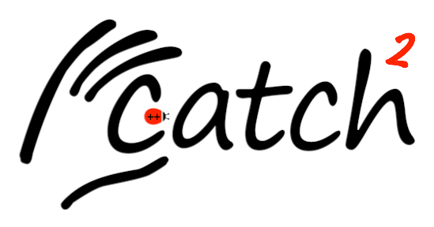

<a id="top"></a>


[](https://github.com/catchorg/catch2/releases)
[](https://github.com/catchorg/Catch2/actions/workflows/linux-simple-builds.yml)
[](https://github.com/catchorg/Catch2/actions/workflows/linux-other-builds.yml)
[](https://github.com/catchorg/Catch2/actions/workflows/mac-builds.yml)
[](https://ci.appveyor.com/project/catchorg/catch2)
[](https://codecov.io/gh/catchorg/Catch2)
[](https://godbolt.org/z/EdoY15q9G)
[](https://discord.gg/4CWS9zD)

## Catch2 是什么？

Catch2 主要是一个面向 C++ 的单元测试框架，同时也提供基础的微基准测试功能，以及简单的 BDD 宏。

Catch2 的主要优势在于它既简单又自然。测试名称不必是合法标识符，断言看起来就像普通的 C++ 布尔表达式，而 `section` 则提供了一种很自然的本地方式，用来在测试中共享 setup 和 teardown 代码。

**单元测试示例**
```cpp
#include <catch2/catch_test_macros.hpp>

#include <cstdint>

uint32_t factorial( uint32_t number ) {
    return number <= 1 ? number : factorial(number-1) * number;
}

TEST_CASE( "Factorials are computed", "[factorial]" ) {
    REQUIRE( factorial( 1) == 1 );
    REQUIRE( factorial( 2) == 2 );
    REQUIRE( factorial( 3) == 6 );
    REQUIRE( factorial(10) == 3'628'800 );
}
```

**微基准测试示例**
```cpp
#include <catch2/catch_test_macros.hpp>
#include <catch2/benchmark/catch_benchmark.hpp>

#include <cstdint>

uint64_t fibonacci(uint64_t number) {
    return number < 2 ? number : fibonacci(number - 1) + fibonacci(number - 2);
}

TEST_CASE("Benchmark Fibonacci", "[!benchmark]") {
    REQUIRE(fibonacci(5) == 5);

    REQUIRE(fibonacci(20) == 6'765);
    BENCHMARK("fibonacci 20") {
        return fibonacci(20);
    };

    REQUIRE(fibonacci(25) == 75'025);
    BENCHMARK("fibonacci 25") {
        return fibonacci(25);
    };
}
```

_注意，基准测试默认不会运行，因此你需要显式使用 `[!benchmark]` 标签来执行它。_

## Catch2 v3 已发布！

你现在位于 `devel` 分支，v3 版本正在这里开发。v3 带来了不少重要变化，其中最显著的是 Catch2 不再是单头文件库了。现在的 Catch2 更像一个普通库，包含多个头文件，以及单独编译的实现部分。

文档正在逐步更新以适配这些变化，但这项工作目前仍在进行中。

如果你要从 v2 版本迁移到 v3，请查看[我们的文档](docs/migrate-v2-to-v3_zh.md#top)。其中提供了一个简明的入门指南，并整理了最常见的迁移问题。

关于上一代主要版本 Catch2，请查看 GitHub 上的 [v2.x 分支](https://github.com/catchorg/Catch2/tree/v2.x)。

## 如何使用

本文档分为三部分：

* [为什么我们还需要另一个 C++ 测试框架？](docs/why-catch_zh.md#top)
* [教程](docs/tutorial_zh.md#top) - 快速上手
* [参考部分](docs/Readme_zh.md#top) - 详细说明

## 更多信息

* 问题和缺陷可以在 [GitHub Issue tracker](https://github.com/catchorg/Catch2/issues) 中提交
* 讨论或提问请使用 [Discord](https://discord.gg/4CWS9zD)
* 了解还有谁在开源场景中使用 Catch2，请查看 [Open Source Software](docs/opensource-users_zh.md#top) 或 [商业场景](docs/commercial-users_zh.md#top)
